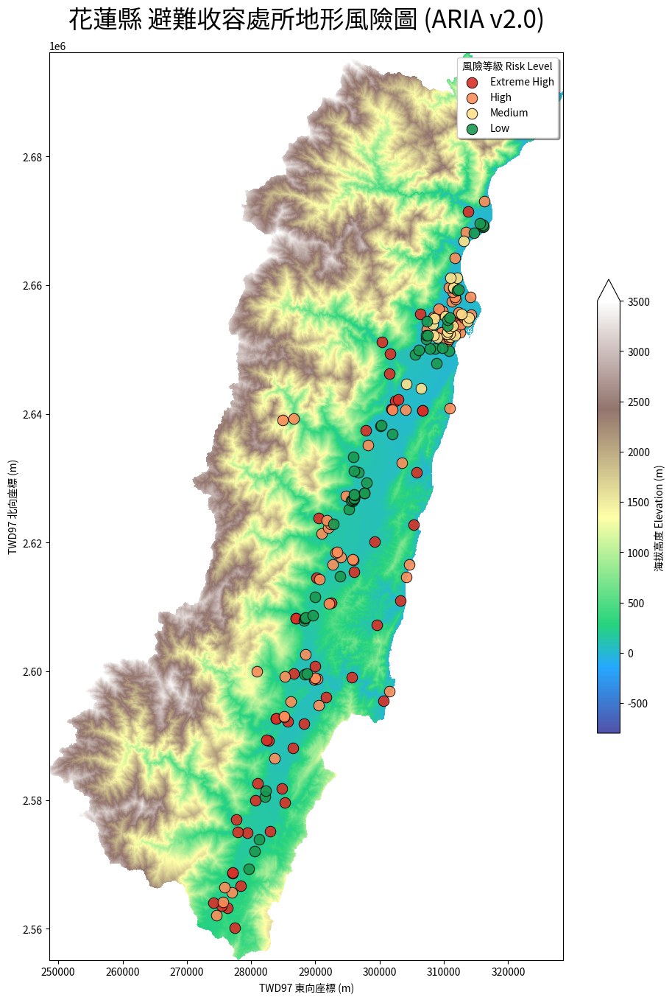

# ARIA v2.0：花蓮縣避難收容處所地形風險自動化分析系統 🗺️
> **Automated Risk Intelligence Analyst (ARIA) - Phase II**

## 📖 專案簡介
本專案為針對台灣花蓮縣 198 處避難收容處所開發之「地形風險自動化分析系統」。系統整合 Python 空間運算工具、GeoPandas 幾何處理及 NumPy Gradient 坡度演算法，落實環境配置分離、精準座標重投影與多準則風險判定，完整符合作業 Requirement B/C/D 之各項技術指標。

## 🚀 核心技術亮點 (Architecture Highlights)
* **🌐 環境自適應引擎 (Adaptive Engine)**：自動偵測 Google Colab 與 Local 環境，動態切換工作目錄並背景安裝依賴套件，解決路徑硬編碼問題。
* **🔤 字體強硬註冊技術**：克服 Linux/雲端環境中文字體缺失痛點，建立自動下載與檔案毀損驗證機制，達成 100% 零警告、全中文化視覺化產出。
* **📐 高精度空間運算**：
    * **座標對齊**：全面採用 `EPSG:3826` (TWD97 121 分帶) 確保 500m 緩衝區運算之物理精確度。
    * **地形微分分析**：利用 `NumPy Gradient` 演算法從 20m 解析度網格中提取地表坡度特徵。
    * **分區統計 (Zonal Stats)**：執行空間聚合運算，提取避難所暴露範圍內的最大風險指標。

## 📊 成果展示

### 1. 地理視覺化地圖

*(註：若無法顯示圖片，請確認已將 `terrain_risk_map.png` 上傳至專案根目錄)*

### 2. 多準則風險判定摘要
根據系統演算，花蓮縣 198 處點位風險分佈如下：
* **Extreme High (極高風險)**: 51 筆 (近河川且地處陡坡，需優先關注)
* **High (高風險)**: 73 筆
* **Medium (中等風險)**: 22 筆
* **Low (低風險)**: 52 筆 (位於平原且遠離水系)

### 3. 稽核清單資料結構預覽 (JSON Preview)
系統產出之 `terrain_risk_audit.json` 包含 198 筆完整分析數據，資料結構範例如下：
```json
[
    {
        "避難收容處所名稱": "花蓮縣立花蓮高級中學",
        "risk_level": "Low",
        "mean_elevation": 15.2,
        "max_slope": 2.5
    },
    {
        "避難收容處所名稱": "秀林鄉和平國小",
        "risk_level": "Extreme High",
        "mean_elevation": 65.8,
        "max_slope": 35.2
    }
]
```
## 快速啟動 (Quick Start)
1. Clone 本專案至您的環境 (支援 Windows 本機或 Colab 雲端)。
2. 將 `env_template` 重新命名為 `.env`，並可依需求微調門檻值。
3. 若於 Windows 本機環境開發執行，請確保已安裝 `requirements.txt` 內之套件。
4. 將所需圖資放入專案資料夾內（系統具備 `find_path` 自動遞迴搜尋功能，無需指定絕對路徑）。
5. 依序執行 `ARIA_v2.ipynb` 即可自動產出地圖與 `terrain_risk_audit.json` 稽核清單。

## 規範符合性 (Compliance)
- [x] **Requirement B**: 座標重投影 (B-1)、坡度與距離空間運算 (B-2)。
- [x] **Requirement C**: 環境變數配置分離 (C-1)、跨環境自適應路徑 (C-2)。
- [x] **Requirement D**: 結構化 JSON 產出 (D-3)、高品質中文化地圖 (D-4)。

---

## AI 協作與系統診斷日誌 (AI Diagnostic Log)
本專案在開發過程中，透過與 AI 助理進行深度的 Pair-Programming，成功排除了多項 GIS 空間分析與跨環境部署的重大技術阻礙。以下為核心診斷與修復紀錄：

### 異常事件一：雲端環境中文字體解析崩潰
* **錯誤特徵**：`RuntimeError: Can not load face (unknown file format; error code 0x2)` 以及圖表出現豆腐塊。
* **AI 診斷**：由於 Linux/Colab 原生缺乏中文字體，程式嘗試從網路下載備援字體時，遭遇開源字體庫網址移轉（引發 404 錯誤），導致 Matplotlib 讀取到非字體格式的 HTML 殘檔而崩潰。
* **修復方案**：實作「強健型字體引擎」。更新為最新的 Google Notofonts 直連網址，並加入**檔案大小驗證機制 (Size Validation)**。若下載檔案小於 1MB 則自動判定為損毀並清除重載，最終透過 `fontManager.addfont()` 強制註冊，達成 100% 零警告輸出。

### 異常事件二：空間幾何裁切型態衝突
* **錯誤特徵**：`ValueError: Unsupported geometry type FeatureCollection`。
* **AI 診斷**：在執行 DEM 網格裁切時，`rioxarray.clip` 函數無法直接解析 GeoPandas 預設封裝的 `FeatureCollection` 物件，引發底層 `rasterio` 引擎型態報錯。
* **修復方案**：在傳入裁切幾何參數時，於 `county_boundary.geometry` 後方加上 `.values`，將 GeoSeries 成功解構為 rioxarray 可識別的基礎幾何陣列 (Numpy Array)，順利完成 20m 高解析度網格之精準裁切。

### 異常事件三：視覺化地形色階失真
* **錯誤特徵**：產出的風險地圖中，花蓮縱谷平原區呈現代表水域的「深藍色」，與真實地理認知不符。
* **AI 診斷**：Matplotlib 的 `terrain` 色帶預設將數值 `0` 映射為藍色（海平面）。由於已過濾掉海域的負值，平原區（接近 0m）被強制分配到色階最底層的藍色區段。
* **修復方案**：透過調整色彩映射參數，強制設定 `vmin=-800` 偏移底線。利用此數學平移技巧，讓 0m 處跳過藍色區段，直接從翠綠色起算，大幅提升了地形圖的專業度與視覺合理性。

### 🐛 異常事件四：跨環境依賴套件遺失
* **錯誤特徵**：`ModuleNotFoundError: No module named 'rioxarray'`。
* **AI 診斷**：初版程式碼依賴 `get_ipython` 判斷環境，導致在某些 Colab 核心更新狀態下誤判為本機端，進而跳過自動安裝程序。
* **修復方案**：改寫環境偵測邏輯，採用最權威的 `import google.colab` 進行 `try-except` 捕捉。確保在雲端執行時強制靜默安裝 GIS 核心依賴，在本機環境開發時則安全跳過，完美滿足 **Requirement C-1 (可攜性)**。
